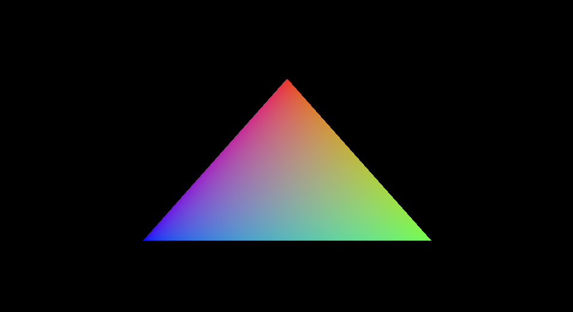
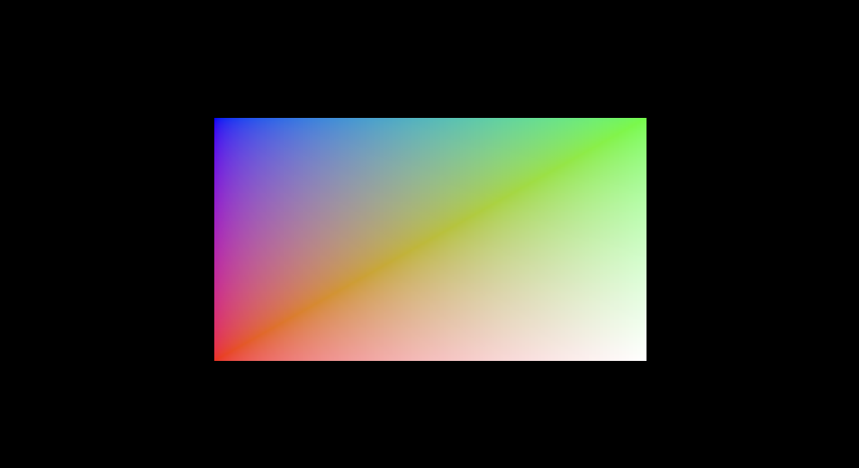
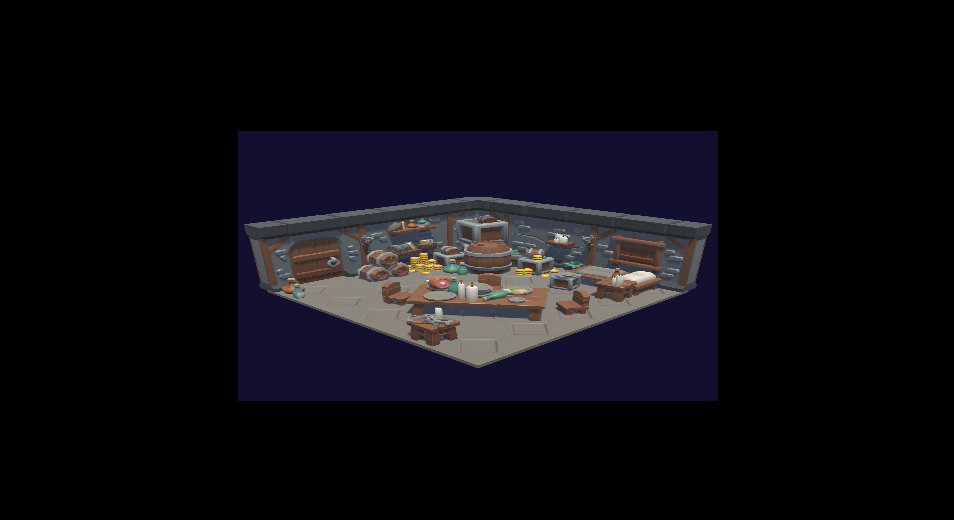
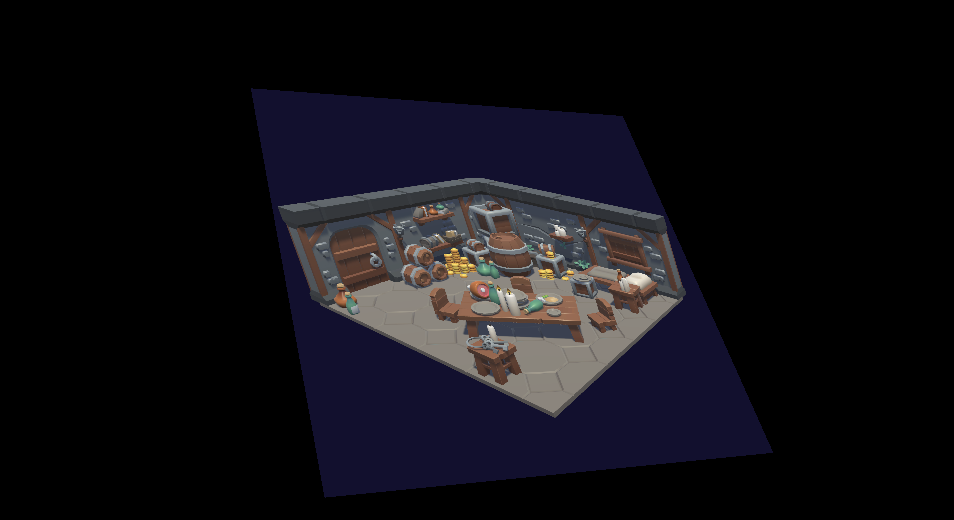
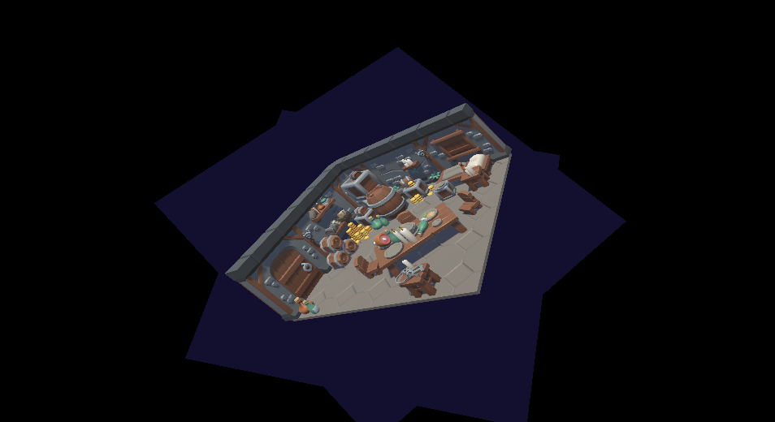
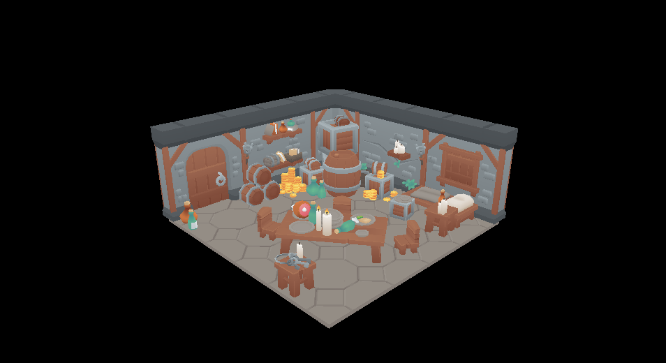
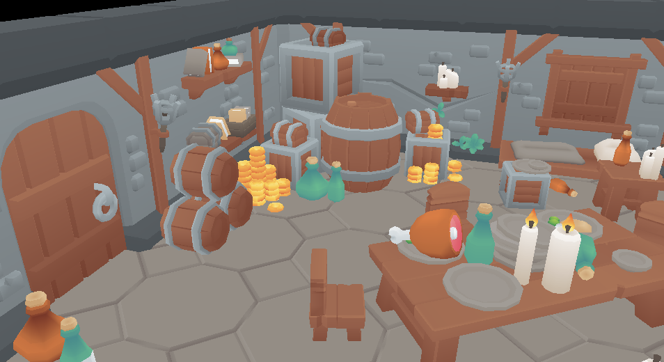
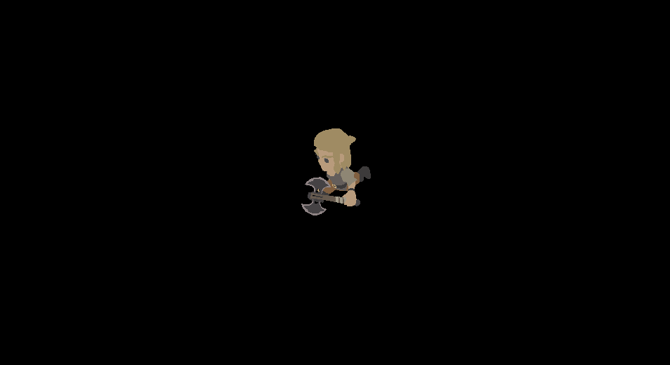

# Istok

A modern cross-platform open-source C# Game Engine with a Vulkan rendering backend. But that will happen sometime in the future.

For now it is a cross-platform wrapper for the Vulkan API, designed to make it easier to use, and the beginning of development of a player loop, a component and an animation systems.

The main goals of the project:
- Create a cross-platform engine entirely (as far as possible) in C#
- Use one low-level graphical API Vulkan for all platforms
- Provide the maximum possible access to the low-level part of the engine for developers

## Under the hood:

[Silk.NET](https://github.com/dotnet/Silk.NET) was chosen to interact with low-level APIs. Because it is a high-speed, advanced library, actively developed and is a .NET Foundation project.

[MoltenVK](https://github.com/KhronosGroup/MoltenVK) is used to support Vulkan on iOS and macOS. On iOS, Simulator and Mac Catalyst, the `Silk.NET.MoltenVK.Native` package is used. For macOS, you need to install the Vulkan SDK (https://vulkan.lunarg.com/sdk/home#mac) or add the library to the project (https://github.com/KhronosGroup/MoltenVK/releases)

## Supported platforms: 

- ✓ iOS
- ✓ iOS Simulator
- ✓ macOS
- ✓ Mac Catalyst
- ✓ Android (Android Emulator on macOS not support Vulkan for now)
- ✓ Windows

## Examples

You can see how to run examples in the ExamplesRunner or iOSExamplesRunner or AndroidExamplesRunner projects.

Each given example is a complication of the previous one, which is convenient for studying them in order.

SPIR-V is used for shaders in Vulcan. The folder with compiled shaders also contains their GLSL sources. To recompile them from the terminal go to the Shaders folder (`cd examples/Assets/Shaders`
), and run `glslc \[shader_name]_shader.vert -o \[shader_name]_vert.spv` 

|                                          |                                                                        | description                                                                                                                                                            |
|------------------------------------------|------------------------------------------------------------------------|------------------------------------------------------------------------------------------------------------------------------------------------------------------------|
| TriangleExample                          |                           | Basic example of how to create Graphics, CommandList, Pipeline, fill and execute CommandList. The triangle vertices in this example are hardcoded in the vertex shader |
| QuadExample                              |                               | This example shows how to create, fill, and pass vertex and index buffers.                                                                                             |
| TexturedQuadExample                      |                       | This example shows how to work with Image, ImageView.                                                                                                                  |
| UniformBufferExample                     |                      | This example adds the creation and use of a Uniform Buffer.                                                                                                            |
| SimpleCameraAndRendererComponentsExample |  | This example demonstrates the use of PlayerLoop, Node and Components.                                                                                                  |
| GltfExample                              |                               | This example demonstrates loading a simple scene from a GLB file                                                                                                       |
| GltfExampleAnimation                     |                      | This example demonstrates loading an animation from a GLB file                                                                                                         |
| GltfSkinnedMeshExample                   |                    | This example demonstrates loading a Skinned Mesh from a GLB file                                                                                                       |

The examples use models and textures from [Kay Lousberg](https://kaylousberg.itch.io) and [Quaternius](https://quaternius.itch.io). Many thanks to them for their work.